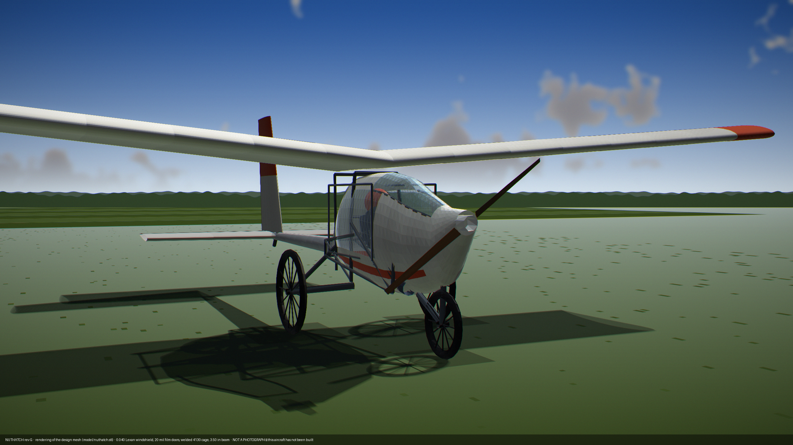

# Nuthatch — An Open Single-Seat Ultralight

The Part 103 fleet is mostly 1980s designs. They are cheap, they are buildable in
a garage, and they hurt people in a small number of well-understood ways:

- **Ground loops**, because almost all of them are taildraggers
- **Stall-spin departures**
- **Nothing structural ahead of the pilot's legs**
- **Lap belts instead of harnesses**
- **A 7:1 glide**, so an engine failure leaves you very few fields to choose from

Every one of those is fixable for roughly 100 build hours and $1,900. Nuthatch is
what that looks like.

A single-seat wood-and-steel ultralight derived from the TEAM Sky Pup and Ison
Airbike. Plans, drawings, calculations, build log, and measured flight data all
live here. So do the mistakes.

**Named after the only bird that climbs down a tree headfirst.** Small, plain, and
does it backwards from everything else in the class.



*A rendering of the design mesh, not a photograph — this aircraft has not been
built. Generated from `model/nuthatch.stl` by `analysis/render-hero.py`.*

**Status: entering final design.** The configuration is settled and reasoned;
the structure is not drawn. There is a 3D model, a drawing set, CAD exports of
the steel frame and a measured visibility analysis — and **no member has been
sized against a load case.** [docs/open-questions.md](docs/open-questions.md)
opens with the four items that gate everything else.

---

## Design targets

| | |
|---|---|
| Cost, materials | under $15,000 |
| Build hours | under 750 |
| Takeoff roll | under 200 ft |
| Fits | a 22 ft garage and a 16 ft flatbed trailer |
| Part 103 | a compliant configuration off the same drawings |

## Current specification

Two configurations, one set of drawings. See [docs/specs.md](docs/specs.md).

| | EAB build | Part 103 build |
|---|---|---|
| Empty weight | 296 lb\* | 250 lb\* |
| Gross | 580 lb | 450 lb |
| Span / area | 31 ft / 130 ft² | same |
| Stall, flaps 40° | 28.4 mph | 22.9 kt |
| Takeoff roll | 140 ft | ~160 ft |
| Climb | 1,010 fpm | ~500 fpm |
| Glide ratio | 12.4† | 12.4† |
| Cruise | 55–60 mph | 55 kt limited |
| Range | ~150 mi | fuel limited |
| Engine | Hirth F-33, 28 hp | direct-drive, ~16 hp |
| Brakes | yes | yes |

\* **Empty weight: two statements, deliberately not reconciled.** The workbook
omits rows (slats — since retired for flaps — and cabane) that the build-log
CSV carries; honest totals are ~308 / ~262 lb. The scrubbed single-build path
reaches 253.2, and the rev G cabane deletion takes the 103 kit to **247.7**.
Reconciliation is parked until the frame is redrawn — see
[docs/specs.md](docs/specs.md).

† **Glide 12.4, not the 10.7 this repo quoted for a long time.** Rev G lowered
the wing onto the cabin roof and deleted the cabane: f 4.84 → 3.68 ft², L/D
10.8 → 12.4. The §22 drag cleanup would take it to 13.6, but that is proposed,
not adopted. Nothing here is measured.

**Powerplant roadmap: gasoline first, hybrid second, electric third.** Electric,
when it comes, is an EAB-only path — a Part 103 all-electric build has 8 lb of
battery budget left after the airframe and drive, which is about four minutes.
Part 103 stays gasoline. Worked in
[docs/trades/pusher-vs-tractor.md](docs/trades/pusher-vs-tractor.md).

## Configuration

- Nose-mounted tractor propeller. Pusher was analysed and rejected for the
  gasoline aircraft: efficiency is a wash, and it does not close on balance
- Welded 4130 cockpit cage + single straight 4130 tail boom, all-wood
  cantilever wing sitting directly on the cabin roof (no cabane), fabric
  over everything
- Reclined pilot; **the entire nose is glazed** — from the cowl joint back to
  the wing leading edge and down to the cage's lower longeron, in thin (0.040)
  Lexan. The engine cowl is the only opaque panel forward of the pilot. The two
  doors are thin clear film; a mounted film cutter is the egress tool
- Ram-air NACA ducts, closable for winter — the cabin deletes ~20 °F of wind
  chill rather than making heat. **Doors both sides are an EAB kit item**;
  the Part 103 aircraft carries the windshield and vents without them
- Constant chord, 3-piece removable wing, two bolts per cap per joint
- Douglas fir truss ribs, plywood D-tube leading edge, Oratex covered
- Aluminum tube spar caps with a wrapped sheet shear web
- Single-lever plain flaps, inboard ~60% span (0/25/40°, one-piece torque
  tube; replaced the fixed slats — [docs/trades/flaps.md](docs/trades/flaps.md))
- Two-axis control: elevator and rudder, roll via spoilerons and dihedral —
  one stick (pitch fore/aft, spoilerons lateral, twist-grip rudder), left-hand
  symmetric spoiler lever for glidepath; no rudder pedals
- Tricycle gear, castoring raked nose leg, trailing-arm mains with MTB
  coil-overs, bicycle hydraulic disc brakes
- Structural nose bow ahead of the pilot's feet, rollover hoop, 5-point
  harness anchored to the cage, mesh sling seat over a crushable
  bottom-out pad (energy-absorbing, without the rebound of a bare sling)
- BRS hard points designed in

## What makes it different

**Glide.** 12.4:1 predicted against roughly 7 or 8 for the aluminum-and-Dacron
aircraft in this class. That is a safety number as much as an efficiency one: engine-out you
reach twice the ground area.

**Crash structure.** Steel tube nose bow forward of the pedals and a rollover
hoop behind your head, so there is a survivable volume rather than fabric.

**Visibility, measured.** 61.3% of the whole sphere gets out, and 42% of the
±30° ahead-and-down sector a pilot lands on — against 40.0% and 4% for the
half-glazed version this replaced. Ray-cast from the pilot's eye against the
same mesh the drawings come from, in
[analysis/visibility.py](analysis/visibility.py). The straight-ahead view is
limited by the **engine**, not the glazing, and that is written down too.

**No ground loop.** Tricycle gear with a steerable nose.

**No aileron spin mode.** Roll comes from spoilerons, which produce proverse yaw
and cannot be cross-controlled into a spin.

**A fail-safe autopilot path.** Spoilerons are single-acting with spring return,
so an autopilot servo has no failure mode that takes roll control away from the
pilot. See [Junco](https://github.com/allenmcghan/junco).

## Repository layout

```
docs/specs.md        the current specification, one page, with sources
docs/design-log.md   every decision and the number behind it
docs/open-questions.md   what blocks drawing, most-blocking first
docs/trades/         21 worked configuration trades — index in its README
analysis/            the models: frame, aero, visibility, weights, CAD export,
                     geometry and renderers. Everything regenerates from here
cad/                 DXF, AutoCAD script, tube schedule — from analysis/frame.py
drawings/sheets/     GA-001, LG-001, CP-001, ST-001 + the collected PDF
drawings/renders/    shaded renderings and the visibility chart
model/               nuthatch.stl (rev H) and the quarter-scale validation plan
build-log/           measured weights against estimates, failures
flight-test/         Phase I plan and logged data
```

Detail drawings (`drawings/wing`, `fuselage`, `tail`, `gear`, `fittings`) are
empty placeholders — that is the work of the final design phase.

## CAD

The steel frame lives in [analysis/frame.py](analysis/frame.py) as a node and
member table — not as drawing geometry. Everything downstream reads it, so
moving a node updates the STL, the drawings, the cut list, the weight and the
visibility numbers together. [cad/](cad/) holds the generated DXF, an AutoCAD
script and the tube schedule; `cad-export.py --from-dxf` reads an edited DXF
back. Recommended CAD and the round trip are in [cad/README.md](cad/README.md).

The first thing that check found: **the frame is currently in six disconnected
pieces** — see [docs/open-questions.md](docs/open-questions.md).

## The two files worth reading first

**[docs/design-log.md](docs/design-log.md)** — every decision and the number
behind it, including the configurations that lost and why. Drawings exist for a
dozen aircraft in this class. Reasoning does not.

**[build-log/measured-weights.csv](build-log/measured-weights.csv)** — estimated
against actual weight, part by part, as parts arrive. Every published weight in
this class is a claim. This one will be a measurement.

## Contributing

Corrections to the analysis are the most valuable contribution, especially on
spar sizing, flap geometry, and load cases. Open an issue with your numbers.

## License

Documentation and drawings: CERN-OHL-S v2 (see [LICENSE](LICENSE)).
Firmware and tooling, where present: MIT.

## Disclaimer

**This is an experimental amateur-built aircraft design published as a work in
progress. It has never been built or flown.**

Nothing here has been reviewed, certified, or validated by any authority. The
structural analysis is preliminary and every weight is an estimate until the
build log says otherwise. Slat geometry, spar sizing, and load cases are
explicitly unresolved.

If you build from this, **you are the manufacturer.** You are responsible for
your own structural analysis, your own airworthiness determination, and your own
decision to fly. No warranty of any kind is offered or implied, expressed or
otherwise, including fitness for any purpose.

Aircraft built to Part 103 require no pilot certificate. That does not make them
safe to fly without training. Get instruction.
